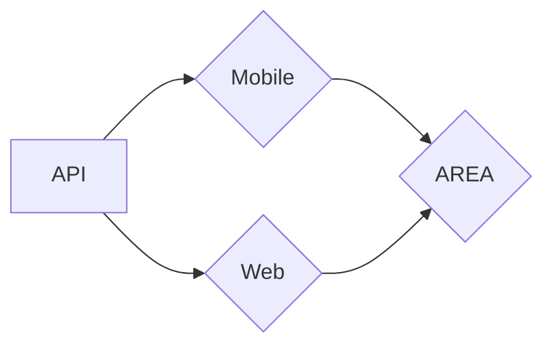
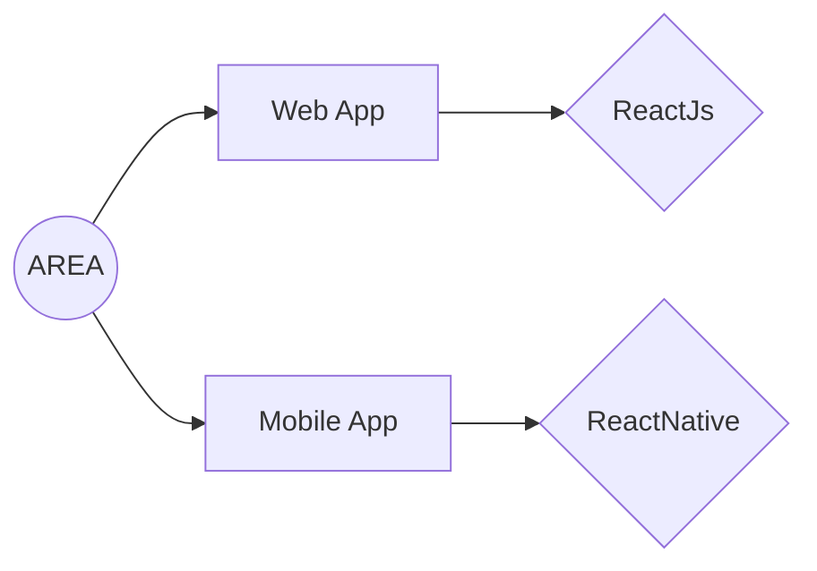
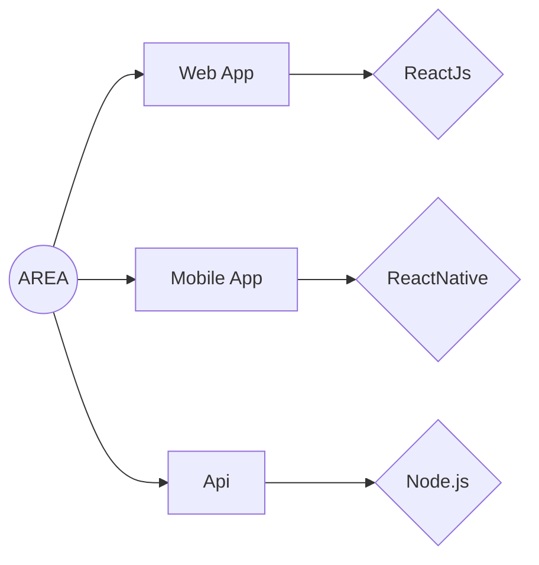

# Stonk's Area!

This is our project **AREA** of third year in Epitech Lille.

|     Server    |       Web       |        Mobile         |
|    Thomas     |      Alex       | Enguerrand & Maxime   |
| :------------ | :-------------: | ---------------------:|
|    Node.js    |      Reactjs    |        ReactNative    |
|    Express.js |                 |                       |
|    MySQL      |                 |                       |

## Usage
- Install docker for running the project.

- Run `cd client && npm i randomcolor && cd ..`
- Run `docker compose build && docker compose up`

### Informations
- The server is host on (localhost:8082)
- The application mobile is host on (xxxx)
- The application web is host on (8081)

## Services ## Action

**Reddit**

- newPost: notif you when a new post is made on the subreddit you gave
- topPost: notif you when of the top post on the subreddit
- topPostToday: notif you of the top post of the day on the subreddit you gave

**Github**

- newPullRequest: notif you when a new pull is made on a repository
- newIssue: notif you when a issue is create
- newPush: notif you when a new push is made on a repository that you gave

**Twitter**

- newTweet: notif you when a new tweet is do on an account you gave us

## Services ## Reaction

**Discord**

- messageDiscord: a bot discord notif you of the action you have chosen in a channel

**E-Mail**

- sendMail: send a notification email directly to the mailbox you gave us

## Technical Environnement

## FRONT

## BACK

